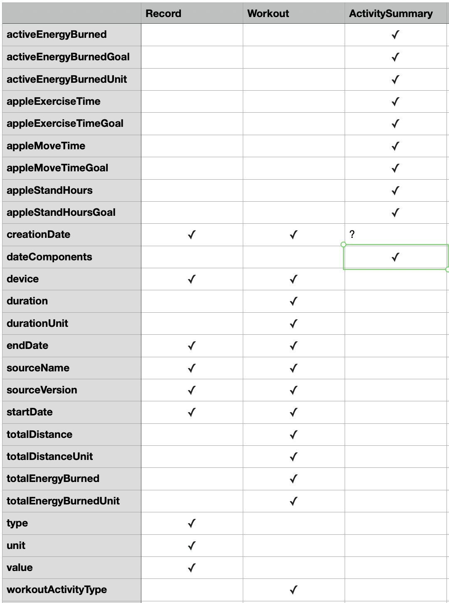
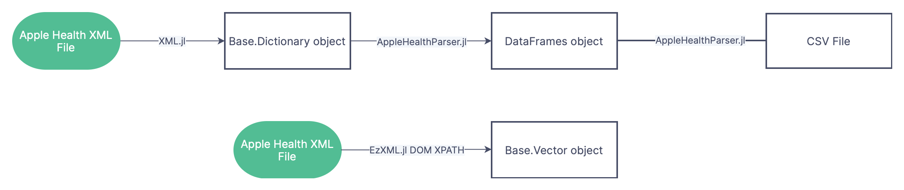

# The Method

There is no one correct way to parse this document. Many have been done before. The [first](https://www.r-bloggers.com/2021/02/extracting-heart-rate-data-two-ways-from-apple-health-xml-export-files-using-r-a-k-a-the-least-romantic-valentines-day-r-post-ever/) and [second](https://rpubs.com/heidithornton09/AccessingAppleHealthData) examples highlighted in R used the DOM API in the R XML parser module and as will be explained in this documentation does not seem scalable for years worth of data. The [first](https://www.tdda.info/in-defence-of-xml-exporting-and-analysing-apple-health-data) and [second](https://github.com/jameno/Simple-Apple-Health-XML-to-CSV) examples in Python2 and Python3 respectively are instructive and use a parser that doesn't load the entire file onto local memory. Those analyses overlap with what is presented in this documentation and source code but there are also some differences in approach. 

## How the Data is Structured

Unlike other XML documents where the data is stored in the elements individually Apple has decided to store the strings containing data as attributes. There is also a nesting structure where elements of a certain title can have elements that themselves follow the same structure of data contained in attributes. The three types of nodes for which nesting can occur have the following titles "ActivitySummary", "Record", "Workout". The full structure of the file is laid out in the DTD syntax.

## A single flat table is not a suitable export format for this data

It may be reasonable to think that because this document contains a series of nodes which each contain a set of attributes to create a dictionary for each node and convert that to appear all in the same dataframe. The image below shows some of the attributes are shared in common with three main nodes



While there is some overlap in fields this visual shows that the resulting table of a simple export will have a lot of sparsity which is not efficient for storing larger data. Apple also deliberately seems to make some fields with similar properties have different names on purpose like in the naming convention of the date fields.

## The Processing Method needs to scale with Big Data

The most convenient and efficient method to extract data from a .xml file for analysis is to use the DOM API along with XPATH 



The following code snippet illustrates how any piece of data can be extracted as a vector and then used to make a graph or used for a regression

```
using EzXML
filename = joinpath(dirname(pathof(AppleHealthParser)), "..", "test", "data", "reconstructed.xml")
doc = readxml(filename)
nodecontent.(findall("//Record//@value", doc))
```

This grabs all the "value" values for each Record element in the file. Any other key is similarly accessible. The language this is written in is of course Julia but XPATH syntax is similar in other scientific computing languages. In user testing loading the data into local memory to facilitate this is not not reasonable for larger amounts of data that exceed 100,000 observations or so. Therefore the more convoluted process is followed in the flowchart above.

## The three main tags for which elements can be nested are the export object names

Whether it is a vector of dictionaries or DataFrames or .csv files it makes the most sense to export the data separated by whether it is a "Record", "ActivitySummary" or "Workout". This is because Apple has decided to nest metadata in these elements. The nested metadata sometimes makes sense out of this context but frequently does not.