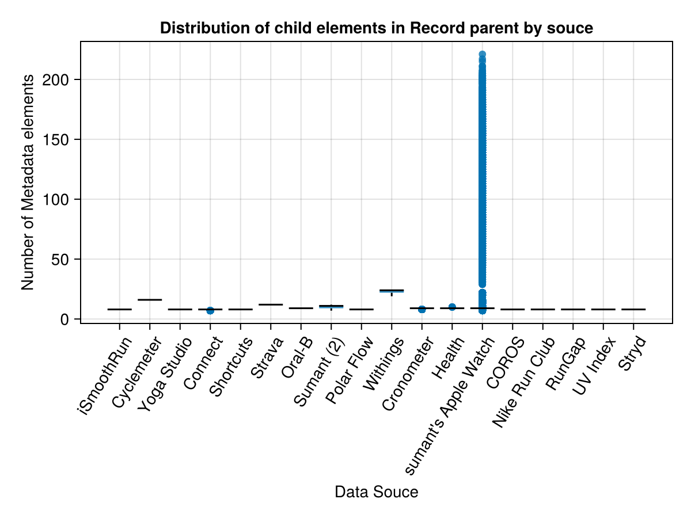
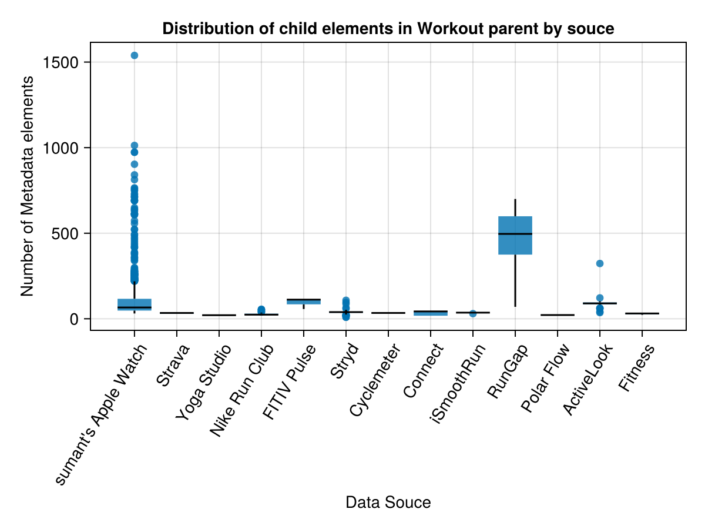

# Implementation

Throughout this document reference will be made to a specific XML file as an illustrative example. This is reconstructed from an earlier example in Python2 which is publicly accessible at time of writing. The author will also intersperse graphs from his own exploration in order to make points.

## Streaming Parser

As mentioned earlier in this documentation the best XML parser to handle big data is a streaming API that doesn't load all the data into memory. There are currently two available in Julia in the EzXML.jl module with Streaming API and the XML.jl module with LazyNode. The XML.jl module is preferred because it allows the user to access the nesting structure rather than just the contents of the current node.

## Implementation Details

There are two exportable functions depending on if the user wants to handle the inherently unstructured metadata. If the metadata is to be appended as attributes to the nesting element it is done in the following way using the example XML file as a guide.

```
    <Record type="HKQuantityTypeIdentifierHeight"
            sourceName="Health"
            sourceVersion="9.2"
            unit="cm"
            creationDate="2016-01-02 09:45:10 +0100"
            startDate="2016-01-02 09:44:00 +0100"
            endDate="2016-01-02 09:44:00 +0100"
            value="194">
     <MetadataEntry key="HKWasUserEntered" value="1"/>
    </Record>
```

becomes

```
    <Record type="HKQuantityTypeIdentifierHeight"
            sourceName="Health"
            sourceVersion="9.2"
            unit="cm"
            creationDate="2016-01-02 09:45:10 +0100"
            startDate="2016-01-02 09:44:00 +0100"
            endDate="2016-01-02 09:44:00 +0100"
            value="194"
            MetadataEntry1key="HKWasUserEntered"
            MetadataEntry1value="1"
    </Record>
```

If the data is fixed width then the output format is a .csv file. If the metadata is included the data contained in the dictionaries is no longer fixed width and a simple export to .csv file is no longer feasible. While the example metadata above in the sample file is simple real life data frequently is not. 

## Recommended Approach After Vector of Dictionaries Is Exported

After splitting the data into "Record", "ActivitySummary" and "Workout" vectors it makes the most sense to split the "Record" and "Workout" vectors by the attribute "sourceName". This is because the data is structured differently and it is convenient to handle different types separately.

The metadata from Apple Watch under the "Record" element is frequently the instantaneous heart rate as a constant data stream for all hours of the day while the device is worn. This type of data is unstructured and inherently long. The export file could therefore be a long DataFrame or simply a vector of observations that ignores the Record element it is nested in because the date time is already universal.

On the other hand data from Withings relate to various body measurements with a fixed amount of observations each time a weighing scale is used. This data is inherently wide and makes more sense with a wide DataFrame. 



